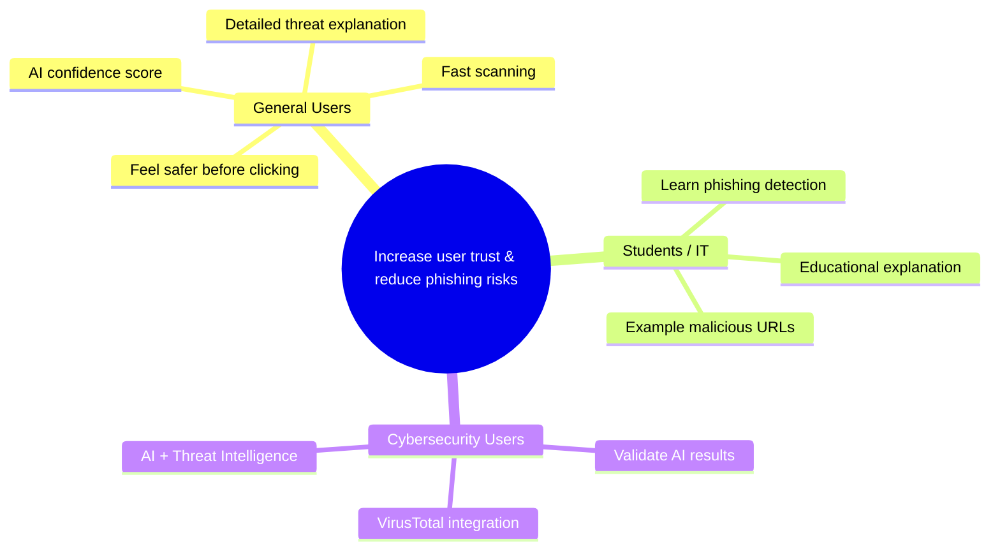
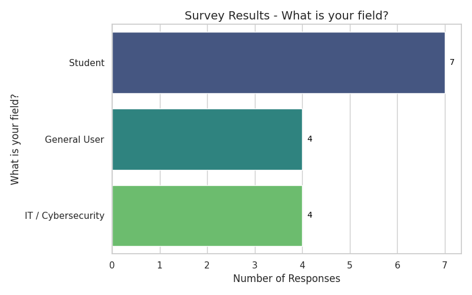
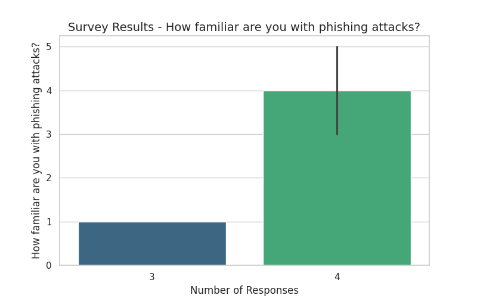
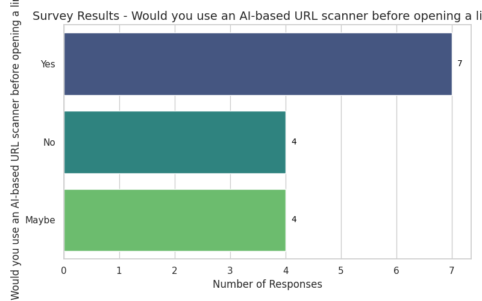
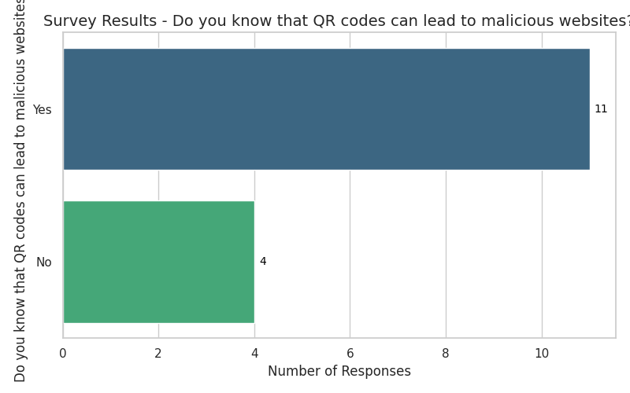
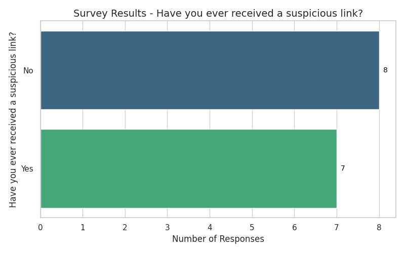
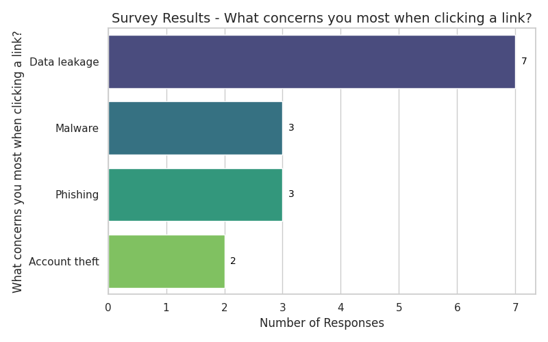
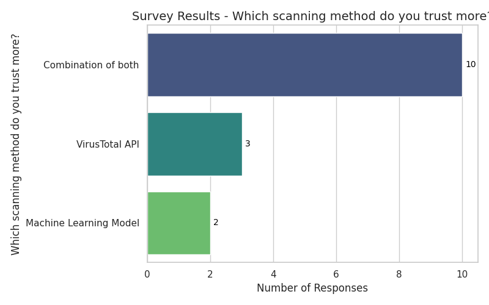
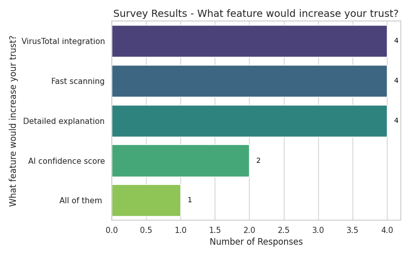
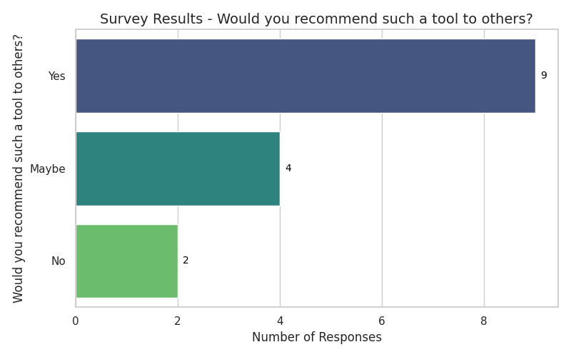

# 🛡️ QR Guard
**AI-Powered URL & QR Security Scanner**

[](https://github.com/your-repo-link) 
[](LICENSE) 
[](https://github.com/your-repo-link/releases)

Protect before you click.  
Smart detection. Clear explanation. Zero guesswork.

---

## 🚨 The Problem
Many users click suspicious links without verification.  
Phishing attacks remain one of the most common cyber threats.

## 🎯 Our Mission
Increase user trust and reduce phishing risks before opening any URL or QR code.

---

## ✨ Core Features
- 🧠 **AI-Based URL Classification**  
- 📊 **Confidence Score** for every scan  
- 🛡️ **VirusTotal Integration**  
- 📖 **Detailed Threat Explanation**  
- ⚡ **Fast & User-Friendly Scanning**  
- 🎨 **Color-Based Risk Indicator (Green / Red)**  

---

## 👥 Target Users

| User Type | What They Need |
|-----------|----------------|
| 👤 General User | Simple safe/unsafe result |
| 🎓 Student / IT | Educational explanation |
| 🛡️ Security-Oriented User | AI + Threat Intelligence validation |

---

## 🗺️ Impact Map

## 📊 Survey Results & Persona
  
  
  
  
  
  
  
  
  

[📄 Persona Report](docs/Persona.pdf)

🛠️ Tech Stack

Machine Learning Model

VirusTotal API

Flutter / React / Python (Add your framework here)

📈 Future Improvements

🌐 Browser Extension

📱 Mobile Version

📷 Live QR Camera Scanner

🔄 Real-Time Threat Updates

⭐ Why QR Guard?

Because security tools should not only detect threats —
they should explain them clearly and build trust.
ر```
