# 🛡️ QR Guard  
## AI-Powered URL & QR Security Scanner

  
  

Protect before you click.  
Smart detection. Clear explanation. Zero guesswork.

---

# 🚨 Problem Statement

Users are frequently exposed to malicious and phishing links.  
Most users cannot confidently determine whether a URL or QR code is safe or harmful before opening it.

---

# 🎯 Mission

Increase user trust and reduce phishing risks before opening any URL or QR code using AI-based detection and threat intelligence analysis.

---

# 🧠 UX Phase

## 📌 Stage I — Research

### 📊 Survey Overview
A survey was conducted with **41 participants** including students, IT/cybersecurity users, and general users to understand awareness and concerns about malicious links and QR codes.

### 🔎 Key Insights
- Users frequently encounter suspicious links.
- High awareness of phishing but low confidence in detection.
- Strong preference for hybrid security systems (AI + threat intelligence).
- Transparency and explanations increase trust.

---

### 🎯 Gains & Pain Points

#### ❌ Pain Points
- Fear of phishing attacks and malicious links
- Lack of technical knowledge
- Uncertainty before opening links
- Risk of data leakage and account theft
- Lack of simple security tools

#### ✅ Gains
- Confidence before clicking links
- Clear and instant security feedback
- Awareness of cyber threats
- Educational explanations
- Safer decision-making

---

### 🧠 Empathy Map

  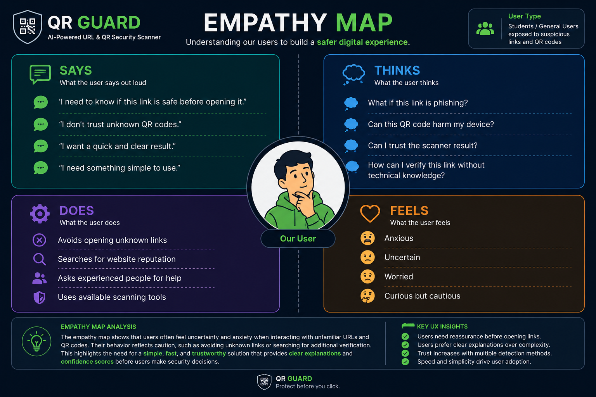

**Key Findings:**
- Users feel anxious before opening unknown links.
- They seek fast and reliable verification.
- Trust increases with clear explanations.
- Simplicity is essential.

---

### 👤 Personas

- Initial Personas:  
  [Persona Report](docs/Persona.pdf)

- Updated Personas:  
  [Updated Persona Report](docs/User_Persona_Infographic.pdf)

---

## 📌 Stage II — Define

### 🔎 5W + H Analysis

| Element | Description |
|--------|-------------|
| Who | Students, IT users, general users |
| What | Difficulty identifying safe vs malicious links |
| When | When receiving links or QR codes |
| Where | Mobile apps and web browsers |
| Why | Increase in phishing attacks and lack of awareness |
| How | Using AI + threat intelligence analysis |

---

### ❗ Problem Statements

1. Users need a reliable way to verify URLs before opening them due to increasing phishing attacks.  
2. Non-technical users struggle to identify malicious QR codes and links.  
3. Existing tools lack simplicity and clear explanations for users.

---

## 📌 Stage III — Ideate

### 🎯 Goal Statements

1. Enable users to verify URLs and QR codes instantly before opening them.  
2. Provide clear, simple, and understandable security feedback.  
3. Increase trust using AI + threat intelligence integration.

---

### 💡 Proposed Solutions

- AI-based URL classification model  
- QR code scanning system  
- VirusTotal integration  
- Risk scoring system  
- Detailed threat explanation  
- Scan history tracking  

---

### ⭐ Selected Solution

A hybrid security system combining:
- Machine Learning model  
- VirusTotal API  
- User-friendly explanation system  

✔ This ensures higher accuracy, transparency, and trust.

---

## 🆚 Competitor Analysis

### VirusTotal
- Strong multi-engine scanning  
- Weakness: Not user-friendly + technical output  

### Google Safe Browsing
- Good malware detection  
- Weakness: Limited explanation  

### Norton Safe Web
- Website reputation system  
- Weakness: Limited QR support  

---

### 🚀 QR Guard Advantage

- Combines AI + threat intelligence  
- Simple explanations for all users  
- Supports QR + URL scanning  
- Provides confidence score  
- Designed for non-technical users  

---
## 🗺️ Impact Map

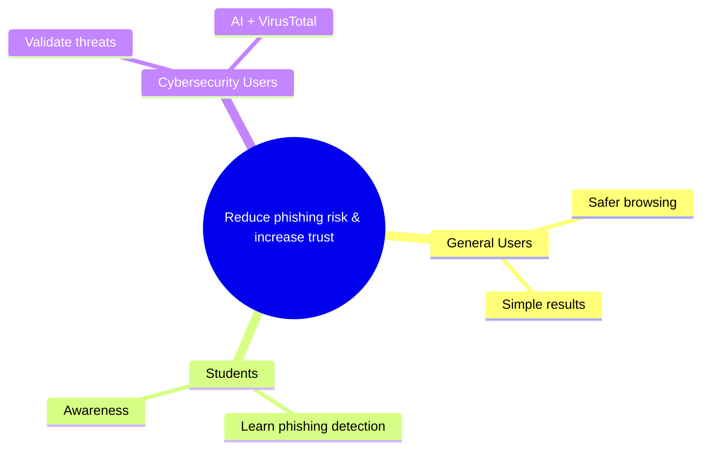
```mermaid
mindmap
  root((Reduce phishing risk & increase trust))
    General Users
      Safer browsing
      Simple results
    Students
      Learn phishing detection
      Awareness
    Cybersecurity Users
      Validate threats
      AI + VirusTotal
```

## 📌Stage IV — Wireframe

## 📱 Wireframe Description

The wireframe represents the main user flow starting from authentication, scanning process, and result visualization with history tracking.
The following wireframe illustrates the main screens of the QR Guard mobile application and the interaction flow between them.

## 📱 Application Wireframe

 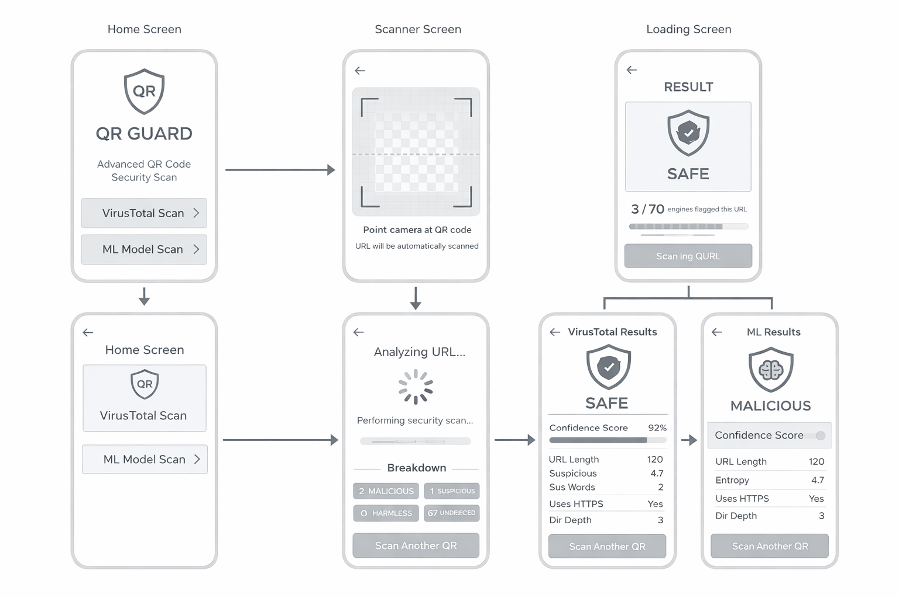 

## 🗺️ Site Map

Home  
│  
├── Login / Signup  
├── Scan URL / QR  
├── Result Page  
├── History  
└── Profile
  
## ✨ Features

🔍 URL scanning
📷 QR code scanning
🧠 AI-based detection
🛡️ VirusTotal integration
📊 Risk score + confidence
⚡ Fast real-time results
🔐 Secure authentication
📱 Clean UI

## 🎨 Design Decisions

- Cybersecurity dark theme  
- Green = Safe, Red = Dangerous  
- Simple UI for non-technical users  
- Clear visual feedback  

## 📊 Survey Results

Survey conducted with 41 participants covering:

phishing awareness
QR security knowledge
trust factors
scanning preferences
(Available in /docs/survey-results/)

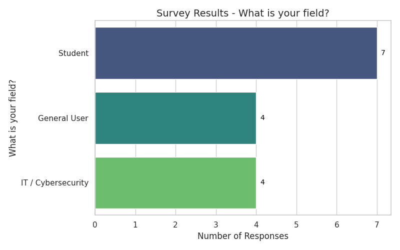  
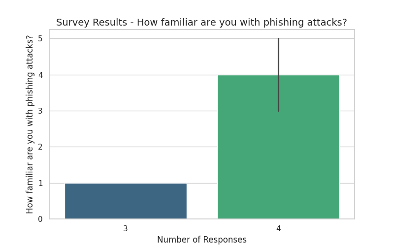  
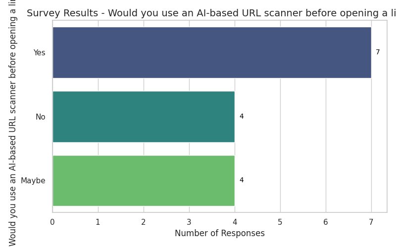  
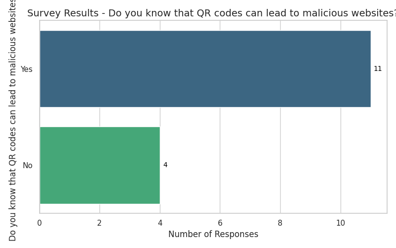  
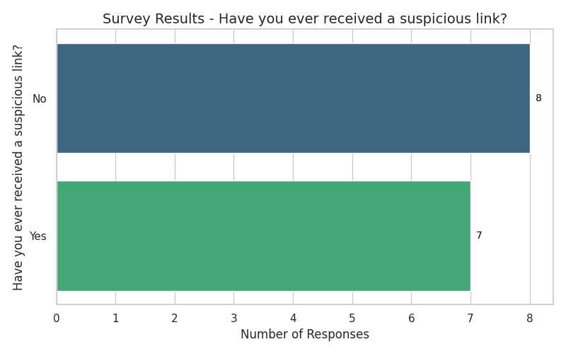  
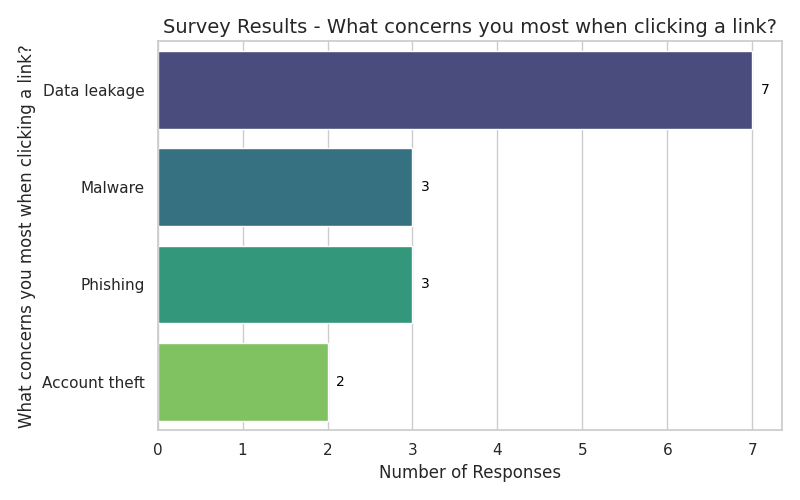  
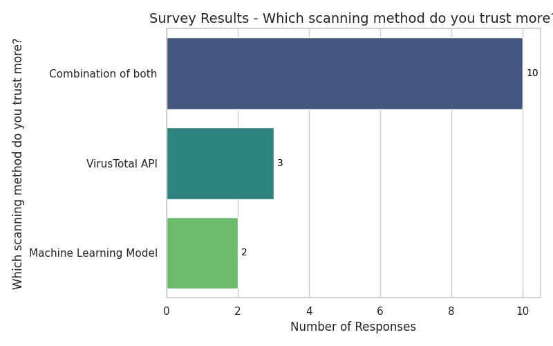  
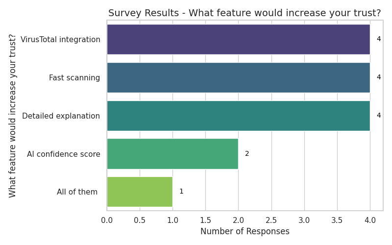  
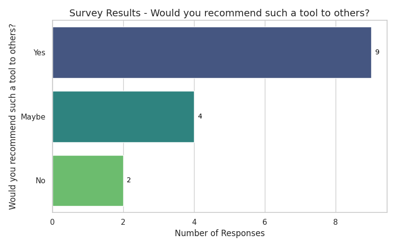  

## 🛠️ Tech Stack
| Layer | Technology |
|------|------------|
| Mobile | React Native (Expo) |
| Backend | Flask |
| Database | SQLite |
| Auth | JWT |
| ML | Random Forest |
| API | VirusTotal |

## 🔐 Authentication System
User registration & login
Password hashing (PBKDF2-SHA256)
JWT-based secure authentication

## 📡 API Endpoints

### Authentication
- POST /auth/register
- POST /auth/login
- GET /auth/me

### Scanning
- POST /scan/ml
- POST /scan/virustotal
- POST /scan/both

### History
- GET /scan/history

## 📉 Problem Impact

Phishing attacks can lead to:
- Data theft
- Financial loss
- Account compromise
- Malware infection

## 🔄 System Flow Diagram

User Input → URL/QR Scan → AI Model → VirusTotal API → Risk Score → Explanation → Result

## ⚙️ Setup Instructions

1. Clone repository  
2. Install dependencies  
3. Run backend server  
4. Start mobile application  

## ✨ Features

- URL scanning  
- QR code scanning  
- AI-based detection  
- VirusTotal integration  
- Risk score & confidence level  
- Fast real-time results  
- Secure authentication  
- Clean UI design  

## 👥 Team Contribution
Frontend Development
Backend Development
Machine Learning Model
UX Research & Survey
Documentation

## ⭐ Why QR Guard?

QR Guard does not only detect threats —
it explains them clearly and helps users make safe decisions.

