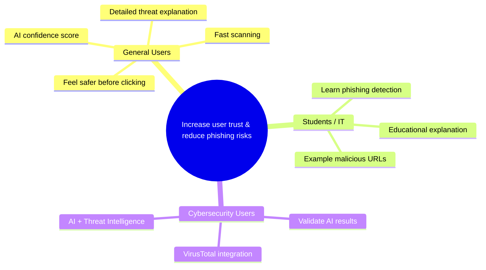

# 🛡️ QR Guard
**AI-Powered URL & QR Security Scanner**

 
 

Protect before you click.  
Smart detection. Clear explanation. Zero guesswork.

---

## 🚨 The Problem
Users are frequently exposed to malicious and phishing links.
Most users cannot confidently determine whether a link is safe or harmful before opening it.

## 🎯 Our Mission
Increase user trust and reduce phishing risks before opening any URL or QR code.

---
## 💡 Proposed Solution

QR Guard provides a fast and reliable way to verify links using a hybrid detection system:

AI model analyzes URL structure and behavior patterns
VirusTotal checks reputation across multiple security engines
Final result is presented in a simple and clear format

## ✨ Core Features

- 🔍 URL scanning and validation
- 📷 QR code security check
- 🧠 Machine Learning-based detection
- 🛡️ VirusTotal integration
- 📊 Risk verdict with confidence score
- ⚡ Fast real-time analysis
- 🔐 Secure authentication system
- 📱 Clean and user-friendly UI
  
## 🎨 Design Decisions

- Dark theme inspired by cybersecurity tools
- Color indicators:
  - Green → Safe
  - Red → Dangerous
- Simple and intuitive interface for non-technical users
- Clear visual feedback and animations during scanning
---

## 👥 Target Users

| User Type | What They Need |
|-----------|----------------|
| 👤 General User | Simple safe/unsafe result |
| 🎓 Student / IT | Educational explanation |
| 🛡️ Security-Oriented User | AI + Threat Intelligence validation |

---

## 🗺️ Impact Map

```mermaid
mindmap
  root((Increase user trust & reduce phishing risks))
    General Users
      Feel safer before clicking
      AI confidence score
      Detailed threat explanation
      Fast scanning
    Students / IT
      Learn phishing detection
      Educational explanation
      Example malicious URLs
    Cybersecurity Users
      Validate AI results
      VirusTotal integration
      AI + Threat Intelligence
```

## 📱 Application Wireframe

The following wireframe illustrates the main screens of the QR Guard mobile application and the interaction flow between them.

  

## 📊 Survey Results 
  
  
  
  
  
  
  
  
  

## 🔍 Key Insights from Survey

- Most users are exposed to suspicious links frequently.
- Users are mainly concerned about data leakage, malware, and account theft.
- The majority prefer a combination of AI and threat intelligence tools.
- Users highly value detailed explanations and confidence scores.
- Many users are willing to use and recommend such a tool.

  ## 👤 Personas

- Initial Personas:
[📄 Persona Report](docs/Persona.pdf)

- Updated Personas:  [📄 Updated Persona Report](docs/User_Persona_Infographic.pdf)

---

## 🛠️ Tech Stack

📱 Mobile Application
.React Native (Expo)
.Expo Router
🧠 Backend
.Flask (Python)
.SQLite Database
.JWT Authentication
🤖 Machine Learning
.Random Forest Classifier
.Feature-based URL analysis
🌐 External API
.VirusTotal API

## 🔐 Authentication System
User registration and login
Password hashing (PBKDF2-SHA256)
JWT-based authentication
Secure API access control

## 📡 API Endpoints
  - Authentication
  POST /auth/register → Create account
  POST /auth/login → User login
  GET /auth/me → Get user profile
  - Scanning
  POST /scan/ml → AI-based scan
  POST /scan/virustotal → VirusTotal scan
  POST /scan/both → Combined scan
  - History
  GET /scan/history → User scan history
  
## 📈 Future Improvements

- 📷 Live camera QR scanning
- 🌐 Browser extension version
- ⚡ Real-time threat intelligence updates
- 📱 Push notifications for suspicious links
- 
## ⭐ Why QR Guard?

Because security tools should not only detect threats —  
they should explain them clearly and build trust.

QR Guard focuses on both detection and explanation to empower users to make safe decisions.

