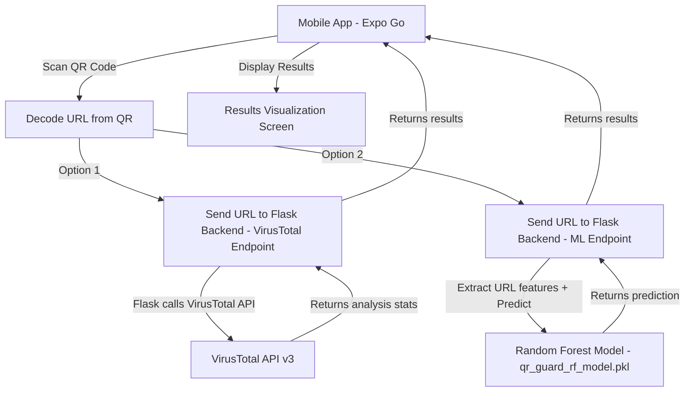
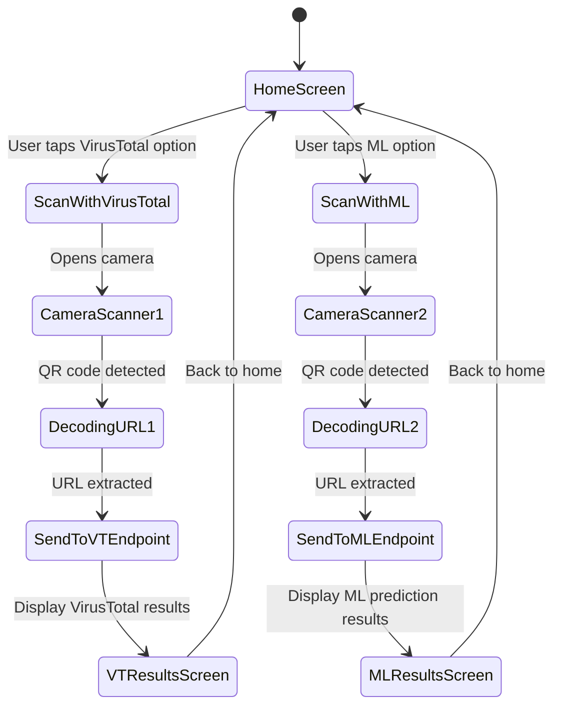

# QR Guard - QR Code Phishing Detection App

## Project Overview
A mobile application built with **Expo Go (React Native)** frontend and **Flask** backend that scans QR codes and checks if the encoded URLs are malicious using two approaches:
1. **VirusTotal API** - Checks the URL against VirusTotal's database of security vendors
2. **Machine Learning Model** - Uses a trained Random Forest model to predict if a URL is phishing

---

## Architecture



---

## Application Flow



---

## Tech Stack

| Component | Technology |
|-----------|-----------|
| Frontend | Expo Go / React Native |
| Backend | Flask / Python |
| ML Model | scikit-learn Random Forest via joblib |
| QR Scanning | expo-camera with BarCodeScanner |
| API | VirusTotal API v3 |
| Styling | React Native StyleSheet with dark cybersecurity theme |

---

## Backend Design - Flask API

### File: `app.py`

#### Endpoints:

1. **POST `/scan/virustotal`**
   - **Input**: JSON body with `url` field
   - **Process**: Base64-encode the URL, call VirusTotal API v3, parse results
   - **Output**: JSON with scan results including malicious votes, total engines, vendor breakdown, and flagged status

2. **POST `/scan/ml`**
   - **Input**: JSON body with `url` field
   - **Process**: Extract 20 URL features using `get_advanced_url_features`, predict using the Random Forest model
   - **Output**: JSON with prediction result, confidence score, and key feature traits

3. **POST `/scan/both`** (combined endpoint)
   - **Input**: JSON body with `url` field
   - **Process**: Run both VirusTotal and ML checks
   - **Output**: Combined results with final verdict

#### Key Functions:
- `calculate_entropy` - Shannon entropy calculation for URL randomness detection
- `get_advanced_url_features` - Extracts 20 features from a URL including length, character counts, entropy, suspicious keywords, IP detection, HTTPS check, shortener detection, directory depth
- `check_virustotal` - Calls VirusTotal API v3 to check URL reputation
- `investigate_url` - Combines feature extraction and ML prediction

#### Features Extracted by the ML Model:
1. `url_length` - Total URL length
2. `hostname_length` - Hostname length
3. `path_length` - Path length
4. `num_dots` - Count of dots
5. `num_hyphens` - Count of hyphens
6. `num_underscores` - Count of underscores
7. `num_slashes` - Count of slashes
8. `num_question_marks` - Count of question marks
9. `num_equals` - Count of equals signs
10. `num_at` - Count of @ symbols
11. `num_ampersands` - Count of ampersands
12. `num_digits` - Count of digits
13. `num_letters` - Count of letters
14. `digit_letter_ratio` - Ratio of digits to letters
15. `url_entropy` - Shannon entropy of URL
16. `num_sus_words` - Count of suspicious keywords
17. `has_ip_address` - Whether URL contains an IP address
18. `has_https` - Whether URL uses HTTPS
19. `has_shortener` - Whether URL uses a known shortener
20. `directory_depth` - Depth of directory path

---

## Frontend Design - Expo Go

### File: `app/index.jsx`

#### Screen States:
The entire frontend lives in `app/index.jsx` using state management to switch between views:

1. **Home Screen** - Dark cybersecurity themed landing page with:
   - App logo/title with shield icon
   - Animated cyber-style background
   - Two prominent scan buttons:
     - Scan with VirusTotal - with shield/globe icon
     - Scan with ML Model - with brain/AI icon
   - Brief description of each approach

2. **Camera/Scanner Screen** - Full-screen QR code scanner:
   - Camera view with scanning overlay
   - Animated scan line
   - Cancel button to return home
   - Auto-detect QR code and extract URL

3. **Loading Screen** - While waiting for API response:
   - Animated scanning/analyzing indicator
   - Cybersecurity-themed loading animation

4. **VirusTotal Results Screen** - Displays:
   - The scanned URL
   - Overall verdict with color coding: Safe = green, Danger = red
   - Number of malicious detections vs total engines
   - Visual progress bar showing detection ratio
   - Detailed breakdown if available
   - Scan again button

5. **ML Results Screen** - Displays:
   - The scanned URL
   - Prediction: Safe or Malicious with color coding
   - Confidence score with animated gauge/meter
   - Key feature traits: URL length, entropy, suspicious words, IP address detection
   - Scan again button

#### Design Theme:
- **Primary Background**: #0a0e27 - very dark navy/black
- **Secondary Background**: #1a1f3a - dark blue-gray
- **Accent Color**: #00ff88 - neon green for safe
- **Danger Color**: #ff4444 - red for malicious
- **Warning Color**: #ffaa00 - amber for suspicious
- **Text Primary**: #ffffff - white
- **Text Secondary**: #8892b0 - muted blue-gray
- **Card Background**: #162447 - dark blue
- **Border/Glow**: #0066ff - electric blue

---

## Required Dependencies

### Python/Backend:
- Flask
- pandas
- joblib
- scikit-learn
- requests
- numpy

### Expo/Frontend:
- expo-camera - for camera access and QR code scanning
- expo-linear-gradient - already installed, for gradient backgrounds
- @expo/vector-icons - already installed, for icons
- react-native-reanimated - already installed, for animations

---

## Implementation Steps

1. **Backend - Complete Flask API** (`app.py`)
   - Implement the full `get_advanced_url_features` function from the notebook
   - Implement `calculate_entropy` helper
   - Implement `/scan/virustotal` endpoint
   - Implement `/scan/ml` endpoint
   - Implement `/scan/both` endpoint
   - Load the Random Forest model on startup
   - Configure CORS for mobile app access
   - Run on `0.0.0.0:5000`

2. **Frontend - Install Dependencies**
   - Install `expo-camera` for QR code scanning
   - Update `app.json` with camera permissions

3. **Frontend - Build UI** (`app/index.jsx`)
   - Create state management for screen navigation
   - Build Home Screen with cybersecurity dark theme
   - Build QR Scanner screen with camera integration
   - Build Loading/Analyzing screen
   - Build VirusTotal Results screen with visualizations
   - Build ML Results screen with confidence gauge
   - Handle errors and edge cases

4. **Testing**
   - Test backend endpoints independently
   - Test QR scanning on physical device via Expo Go
   - Test end-to-end flow for both scan modes
   - Verify results visualization

---

## API Response Formats

### VirusTotal Endpoint Response:
```json
{
  "url": "https://example.com",
  "method": "virustotal",
  "scanned": true,
  "is_flagged": false,
  "malicious_votes": 0,
  "suspicious_votes": 0,
  "harmless_votes": 70,
  "undetected_votes": 5,
  "total_engines": 75,
  "stats": {
    "malicious": 0,
    "suspicious": 0,
    "harmless": 70,
    "undetected": 5,
    "timeout": 0
  }
}
```

### ML Endpoint Response:
```json
{
  "url": "https://example.com",
  "method": "ml",
  "is_malicious": false,
  "confidence": 95.5,
  "prediction": 0,
  "features": {
    "url_length": 23,
    "url_entropy": 3.45,
    "num_sus_words": 0,
    "has_ip_address": false,
    "has_https": true,
    "has_shortener": false,
    "directory_depth": 0
  }
}
```
